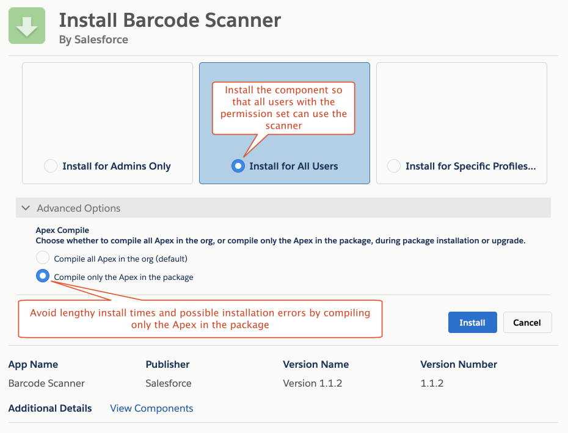
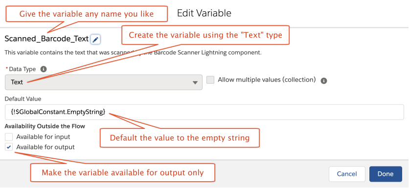
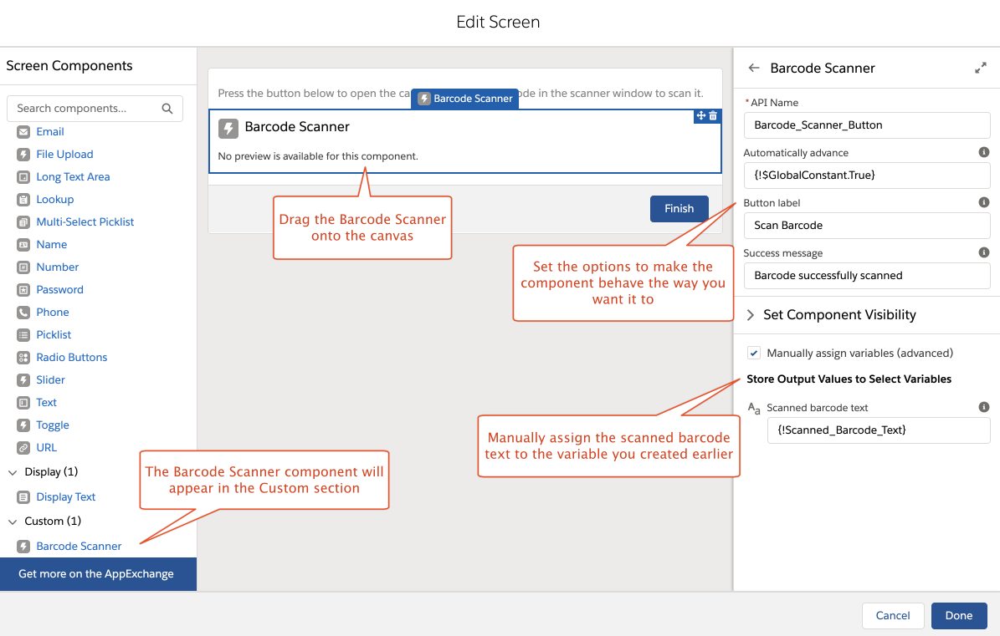
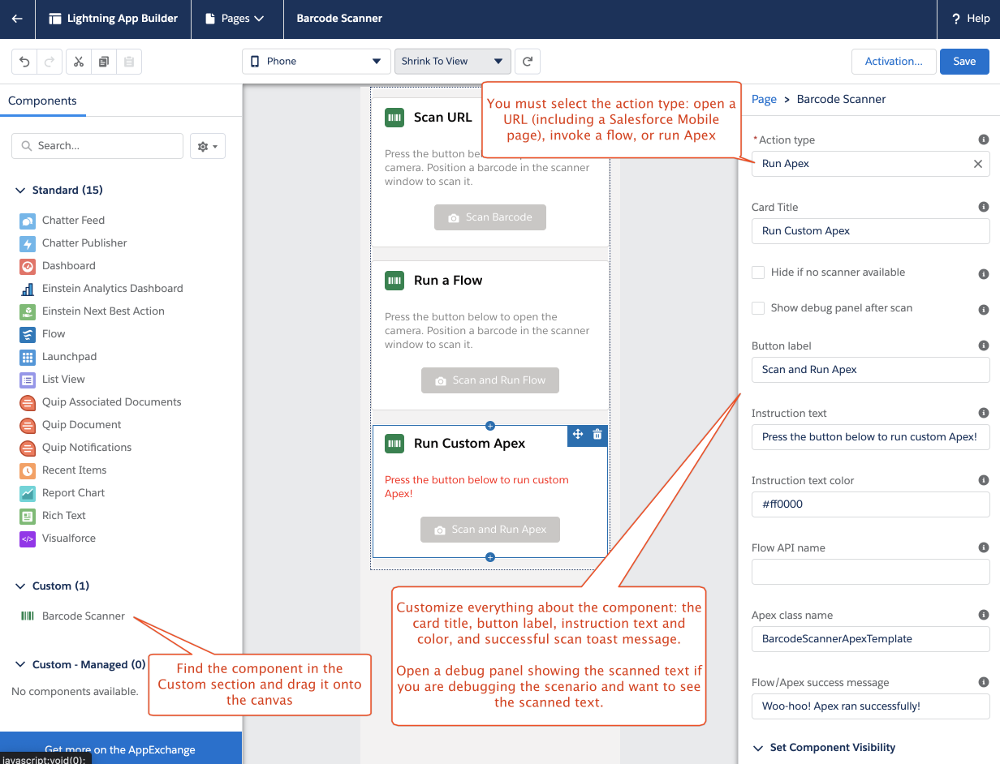

  

<h1 align="center">LIGHTNING BARCODE SCANNER</h1>
<p align="center">
This package contains Lightning components and other support to scan barcodes and take actions within the <a href="https://www.salesforce.com/solutions/mobile/overview/">Salesforce mobile app</a> using the text that was scanned in.
</p>

## Summary

As of the Winter '21 release, Salesforce can take advantage of the native barcode scanning abilities of supported mobile devices. The first is a Lightning flow component that allows bar code scanning to be part of a flow. The second Lightning component in this package allows a user to scan a barcode and either open a scanned URL or take action on the scanned text as part of a home, app, or record page.

**NOTE**: These components will **NOT** work on an experience (formerly "community") page.

**NOTE**: *This capability is still in the beta stage and should be used at your own risk. Furthermore, purchasing decisions should be made on products from Salesforce that are generally available. This capability will also need to go through Salesforce Government Cloud interoperability testing and may not be within the FedRAMP boundary for U.S. Federal customers.*

## Installation and Setup

[Read the disclaimer below](#how-to-deploy-this-package-to-your-org) and click on the **Install the Package** link. This will install all the components, flows, Apex classes, and other metadata to your org. When installing, choose to install for all users and select the "Compile only the Apex in the package" option under _Advanced Options_.



**Important**: After installation, you must assign the `Barcode Scanner` permission set to anyone who needs to use the component. This permission set grants access to the Apex classes that allow full functionality of the component.

## Component 1: Flow Component

This component allows you to insert a barcode scan button into a screen flow. The scanned text will be placed in a variable that you must create as a resource in your flow:



To use the scanner, simply add the flow component to your canvas:



You have two options regarding the behavior of the component after a code is successfully scanned:

- **You can remain on the same screen of the flow**. In this case, a toast will appear informing you that the scan was successfully performed. You have the option of customizing the message that appears in the toast.
- **You can have the component automatically advance to the next item in the flow**. For this to work, you must have a "Next" button on your flow screen. If you choose this option, the next step in the flow will be performed and no toast message will appear, even if you have customized a success message for it.

There is an example flow called `Barcode Scanner Flow Component Template` included in the package which illustrates the component (make a copy of the template if you want to modify it, as any changes to the flow will be overwritten if you upgrade the package to a new version).

## Component 2: Standalone Lightning Component

Create a Lightning app, home, or record page with the Lightning App Builder and drag the `Barcode Scanner` custom component onto the canvas where you would like to place it.



You can customize all the UI elements in the component, including the card title, button label, and instruction text and color.

The component supports several "action types":

- **Scan a URL**: This action type scans a URL and opens it on your device. The URL can be any kind that your device supports. If you create a URL that begins with `salesforce1://`, you can view Salesforce records (as well as edit, follow, and download them) directly inside the [Salesforce Mobile app](https://www.salesforce.com/solutions/mobile/overview/). For example, if you have an account in your org whose record _Id_ is 0015B00001EU6p2QAD, you can encode the string `salesforce1://sObject/0015B00001EU6p2QAD/view` in a barcode (see [Creating and Embedding Barcodes](#creating-and-embedding-barcodes-in-salesforce) below), scan it using this action, and the component will open up the record page for the account within Salesforce Mobile. For a complete discussion of everything you can do with this scheme, [check out the documentation](https://resources.docs.salesforce.com/sfdc/pdf/salesforce1_url_schemes.pdf).
- **Run a Flow**: This action type scans a barcode and passes the text to the `BarcodeText` input variable in an autolaunched flow whose API name you specify in the component customization panel of Lightning App Builder. For example, you might want to capture the _Id_ of a Salesforce record that you wish to use to create related records or perform other processing on. To use this action, you must create a text variable in your flow called `BarcodeText` that can receive the scanned text from this component. Also, if the component is in a Lightning record page, create another text variable called `recordId` that will receive the _Id_ of the record so you may use it in the flow to manipulate the record itself. The package includes an example flow template called `Barcode Scanner Template` that illustrates the scenario (make a copy of it if you want to modify it, as any changes to the flow will be overwritten if you upgrade the package to a new version). The flow simply posts the scanned text to the running user's Chatter feed.
- **Run Apex**: Similar to **Run a Flow**, this action type does the same thing except that it passes the scanned text into an Apex class that you specify in the component customization panel of Lightning App Builder. The package includes an example Apex class called `BarcodeScannerApexTemplate` which illustrates the code (make a copy of it if you want to modify it, as any changes to the class will be overwritten if you upgrade the package to a new version). This example class simply posts the scanned text to the running user's Chatter feed. The Apex class must implement the `BarcodeScannerApexItem` interface:

```apex
public interface BarcodeScannerApexItem {
    // Executes Apex code with the text of the scanned barcode as input.
    //
    // The parameters represent:
    //    barCodeText: the text of the scanned barcode.
    //    recordId: set to the Id of the record, if the component is in a Lightning record page; null otherwise.
    void execute (String barCodeText, Id recordId);
}
```

You have the option of hiding the entire component if no valid scanning capability is found on your device. If this option is not selected, and no valid scanner is found, the component still appears with the scan button greyed out.

You also have the option to open a debug panel under the scan button after the barcode is scanned. The panel will contain the raw text of the code that was scanned. This could be useful for debugging your demos, but you will probably want to turn it off when done.

## Creating and Embedding Barcodes in Salesforce

There are numerous [free barcode generators](#references) around the web that you can use to generate barcode images for your demos. For example, you can embed a barcode for a record _Id_ into an HTML email template using a merge field like this:

```html

```

A Salesforce VisualForce email template would embed the barcode like this:

```html
<apex:image id="theImage" value="https://api.qrserver.com/v1/create-qr-code/?size=150x150&data={!Id}" width="150" height="150" />
```

Similarly, you can create formula fields to embed barcodes inside your Salesforce records using syntax like:

```excel
IMAGE('https://api.qrserver.com/v1/create-qr-code/?size=150x150&data=' & Id, Name, 150, 150)
```

## How to Deploy This Package to Your Org

I am a pre-sales Solutions Engineer for [Salesforce](https://www.salesforce.com) and I develop solutions for my customers to demonstrate the capabilities of the amazing Salesforce platform. _This package represents functionality that I have used for demonstration purposes and the content herein is definitely not ready for actual production use; specifically, it has not been tested extensively nor has it been written with security and access controls in mind. By installing this package, you assume all risk for any consequences and agree not to hold me or my company liable._ If you are OK with that ...

[Install the Package](https://login.salesforce.com/packaging/installPackage.apexp?p0=04t2E000003ZUCcQAO)

## Acknowledgements

- Thanks to Salesforce Platform specialist [Troy Hedges](https://github.com/thedges) for suggesting the flow and Apex action types.
- Thanks to Salesforce solutions engineer [John Scardino](https://github.com/thisisjohnny) for suggesting the flow component.

## References

- Here is a free online [QR code generator](http://goqr.me/api/doc/create-qr-code/) that can generate QR code images for use with Salesforce demos.
- The components in this package recognize these standard barcode types: [Code 128](https://www.barcodefaq.com/1d/code-128/), [Code 39](https://www.barcodefaq.com/1d/code-39/), [Code 93](https://www.barcodefaq.com/barcode-match/), [Data Matrix](https://www.barcodefaq.com/2d/data-matrix/), [EAN-13/GTIN-13](https://www.barcodefaq.com/1d/upc-ean/), [EAN-8/GTIN-8](https://www.barcodefaq.com/1d/upc-ean/), [Interleaved 2 of 5](https://www.barcodefaq.com/barcode-match/), [PDF417](https://www.barcodefaq.com/2d/pdf417/), [QR-Code](https://www.barcodefaq.com/2d/qr-code/), [UPC-E/GTIN-12](https://www.barcodefaq.com/1d/upc-ean/).
- [Salesforce BarcodeScanner Documentation](https://developer.salesforce.com/docs/component-library/documentation/en/lwc/lwc.use_barcodescanner)
- [Barcoding for Beginners](https://www.barcodefaq.com/barcoding-for-beginners/)
## Maintainer

[John Meyer / johnsfdemo](https://github.com/johnsfdemo)

**Current Version**: 1.2.2
